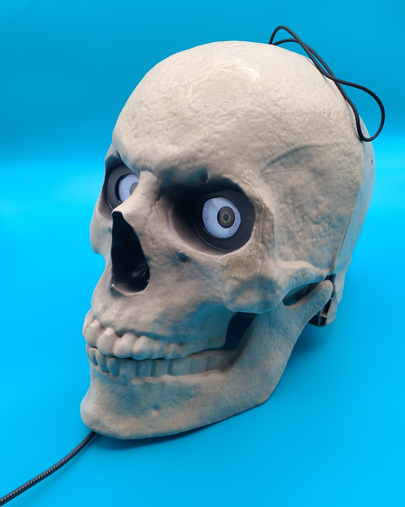
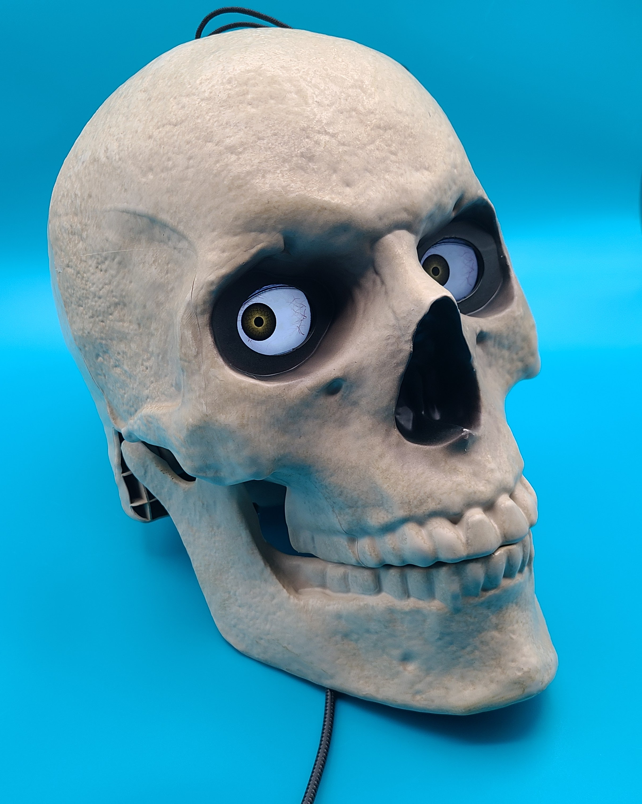
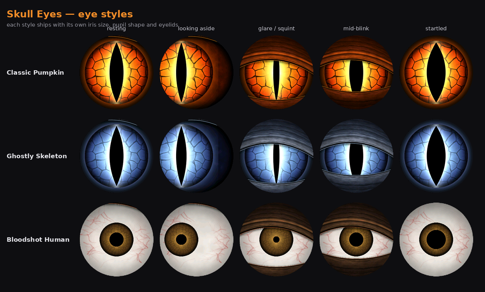
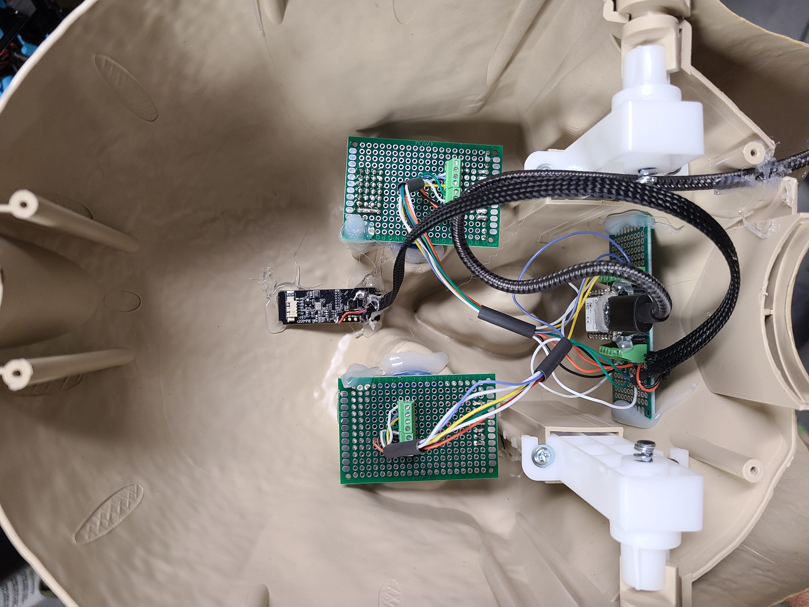
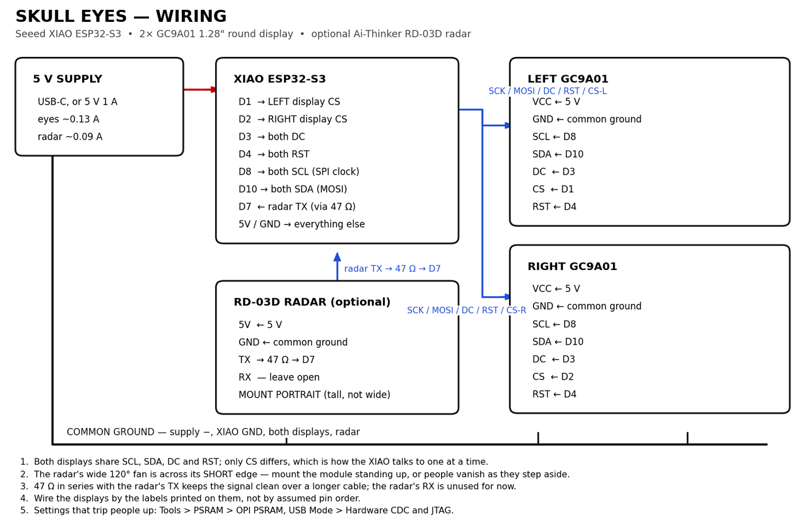
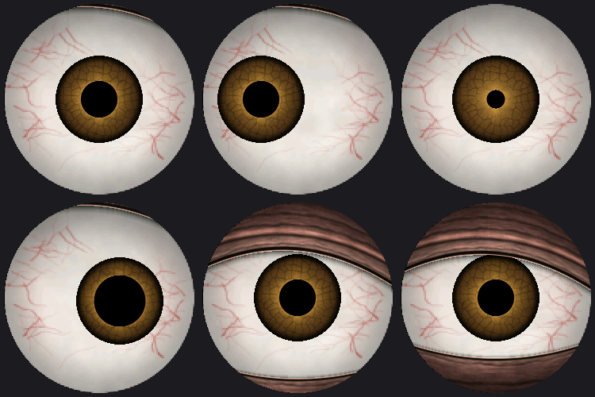

# Skull Eyes

Animated eyes for Halloween props, on two 1.28" round displays driven by a Seeed XIAO ESP32-S3.
A 24 GHz radar lets them watch people: the eyes sleep with their lids shut, snap open when someone
walks up, and follow them around the room. Eye style, colours, schedule and tracking behaviour are
all set from a web page the prop serves itself — no cable, no recompiling.

[https://github.com/backshed-electronics/skull-eyes/blob/main/docs/images/skull_eyes_full20.mp4]
| | |
|---|---|
|  |  |



## What it does

- **Layered eyes, not video.** A fixed socket or sclera, an iris that slides inside it, a live
  pupil with a hot glow, and curved eyelids with folds and a lash line. All drawn per frame, so
  blinks, squints, pupil size and gaze vary freely.
- **Three styles.** Classic Pumpkin (warm fire, slit pupil), Ghostly Skeleton (cold blue-white),
  Bloodshot Human (white sclera with vessels, small brown iris, round pupil). Eyelids are a
  separate choice: ember rind, pale bone, dried flesh, or none at all.
- **Idle behaviour.** Slow deliberate glances with long holds, side-eye, scanning, glaring, sleepy
  droops, unblinking stares, eye-rolls and double-takes, with blinks, pupil "breathing" and a
  candle-like flicker running underneath.
- **Radar tracking.** An Ai-Thinker RD-03D reports where people are; the eyes follow whoever is
  moving, narrow their pupils when someone comes close, go cross-eyed at arm's length, and glare.
- **Learns the room.** Furniture and walls look like targets to a radar. The prop records where
  the fixed echoes are and ignores them, automatically or on command.
- **Sleeps until someone moves.** Lids shut and no drawing at all, then they snap open and lock on.
- **A settings page over Wi-Fi**, with a live radar map and over-the-air firmware updates.

**→ [USER_GUIDE.md](USER_GUIDE.md) explains every control.**

## The build

Mine lives in a Home Accents Holiday "Grave Bones" skull from Home Depot
([product page](https://www.homedepot.com/p/Home-Accents-Holiday-LED-Grave-Bones-Skelly-Skull-26SV25375/339865750)).
Its own LED eyes come out and the sockets take the 1.28" displays.



A piece of perfboard behind each eye carries that display's connections, the harness runs down to
the controller in the jaw, and the radar is glued inside the forehead — **standing portrait**,
which is the detail that makes tracking work.

## Hardware

| Part | Notes |
|---|---|
| Seeed XIAO ESP32-S3 | the 8 MB PSRAM version |
| 2 × GC9A01 1.28" round display | 240×240, SPI |
| Ai-Thinker RD-03D radar | optional; mount it portrait |
| 5 V supply | about 0.13 A for the eyes, plus ~0.09 A for the radar |



## Build it

Arduino IDE with the ESP32 board package, plus the **Adafruit GFX Library** and
**Adafruit GC9A01A**.

| Tools menu | Setting |
|---|---|
| Board | XIAO_ESP32S3 |
| PSRAM | OPI PSRAM |
| USB Mode | Hardware CDC and JTAG |
| Upload Mode | UART0 / Hardware CDC |
| Partition Scheme | leave alone (the default gives 3 MB; this build uses ~1.5 MB) |

Or from the command line:

```
arduino-cli compile --fqbn esp32:esp32:XIAO_ESP32S3:PSRAM=opi --upload -p COM21 firmware/SkullEyes
```

After the first USB flash, later updates go over Wi-Fi from the settings page.

## First run

1. Power it up and join the Wi-Fi network **SkullEyes** (the password is in `skull_web.cpp`).
2. The settings page should open by itself; if not, go to http://192.168.4.1. If your phone drops
   the network for having no internet, tell it to stay connected.
3. Enter your home Wi-Fi. After that the page lives at http://skull.local, or at the IP address
   printed on the serial console at 115200 baud.

## The artwork

The eye art is generated by Python, not drawn by hand: iris fibres, cracks, glow, blood vessels,
eyelid folds and the stretched tissue behind the eye are all procedural, in
`firmware/SkullEyes/art_tools/`.

```
cd firmware/SkullEyes/art_tools
python gen_assets.py ../eye_art.h
```

Needs numpy, scipy and pillow. A new style is mostly a colour ramp and an iris size.



## Notes and limits

- The RD-03D updates about 11 times a second with 0.75 m range steps, and its angle wanders a few
  degrees on someone standing still. It is good for "someone is there, roughly that way" and poor
  for precise aim; the tracking settings trade jitter against lag.
- Frame rate is capped by how fast frames reach the screens: about 21 fps at a 40 MHz display
  clock, about 40 at 80 MHz.
- See [docs/BUILD_LOG.md](docs/BUILD_LOG.md) for the rest of what this project taught us, and
  [docs/FIRMWARE_NOTES.md](docs/FIRMWARE_NOTES.md) for the change history.

## License

MIT — see [LICENSE](LICENSE).
