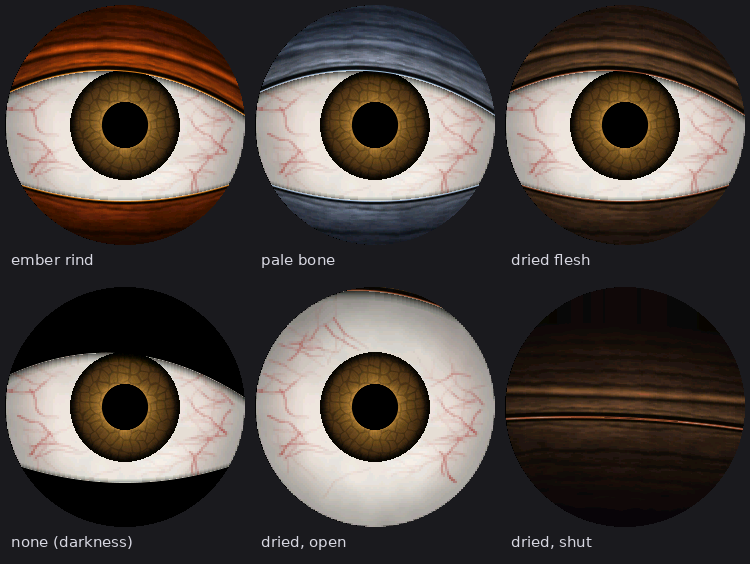

# Skull Eyes — user guide

Everything here is set from a web page the prop serves itself. No cable, no recompiling.

---

## Getting on the page

**First time, or after a Wi-Fi change:** the prop puts out its own Wi-Fi network called
**SkullEyes** (password **skulleyes**). Join it on your phone and the settings page should open by
itself; if it doesn't, go to **http://192.168.4.1**. Enter your home Wi-Fi name and password and
press *Save & restart*.

**After that:** open **http://skull.local** from anything on your home Wi-Fi. Bookmark it. The
SkullEyes hotspot only comes back when the prop can't reach your home network, so if you ever see
it in your phone's Wi-Fi list, something's wrong with the home connection.

The page updates itself every few seconds, so you can leave it open while you walk around.

---

## Status

The top card tells you what the prop is doing right now.

| Line | Meaning |
|---|---|
| **Eyes: ON / OFF** | And why: always on, following the schedule, asleep waiting for movement |
| **Time** | Taken from the internet, with daylight saving handled. "Not set yet" means no internet yet |
| **Wi-Fi** | Which network, and the address to reach it at |
| **Radar** | Whether it's seeing anyone, and how far away |
| **Animation** | Frames per second, current mood, how much artwork is in fast memory |

---

## Wiring

## What the radar sees

A live top-down map, four times a second. The radar sits at the bottom centre looking up the page,
with range rings every metre.

- **Green dot** — the one the eyes are following, labelled with distance and speed
- **Amber dot** — seen and valid, but not chosen
- **Dark dots** — rejected: too near, known furniture, not moving, out of range
- **Grey crosses** — fixed echoes it has learned
- **Orange dashed arc** — the "ignore closer than" limit
- **Blue line** — where the eyes are pointing

If tracking is misbehaving, this map answers why faster than anything else.

---

## The room

Radar can't tell a person from a fridge; both are things that reflect. This is how you teach it
the difference.

- **Learn the room (20 s)** — walk out of the radar's view, press it, and stay away. Everything
  still visible is furniture, and its position is remembered and ignored from then on. Saved, so
  it survives a power cut.
- **Forget** — clears the lot. Do this if you move the prop or rearrange the room.

It also learns quietly: anything sitting in one spot for 30 seconds gets added by itself. Someone
clearly walking is still seen even inside a learned spot, so people passing the furniture don't
go invisible.

---

## Test

**Sweep eyes side to side (60 s)** ignores the radar and swings both eyes their full travel. If
you can't see that from where you stand, the eyes are moving less than you can see and the travel
setting needs raising — that's not a tracking problem.

---

## Mode and schedule

- **Follow schedule / Always on / Always off.** Saving a schedule switches it to Follow schedule.
- **Schedule** — days of the week, plus an Evening and a Morning on-time, each able to be switched
  off, and each able to run past midnight (7:00 PM to 1:00 AM is fine). Pick your time zone.

Until a schedule is saved it stays Always on. If the clock isn't known yet, the eyes stay on.

---

## Look

### Eye style
**Classic Pumpkin** (warm fire, slit pupil), **Ghostly Skeleton** (cold blue-white, slit pupil),
**Bloodshot Human** (white sclera with vessels, small brown iris, round pupil). Changing style
restarts the prop, which takes about ten seconds, because it reloads the artwork.

### Eyelids

**Ember rind**, **pale bone**, **dried flesh**, or **none — just darkness**. Default is whatever
the style ships with. A bare skull has no eyelids, so dried flesh or none usually suits it better
than fresh skin; with none, a blink reads as the eye sinking back into the socket. Changing this
restarts the prop.

### Pupil
**As the style intends** (slit for the beast styles, round for the human one), or force either.

### Colour trim
Brightness, paleness, warm/cool and glow. These retint the artwork in memory, so they apply
instantly with no restart. Brightness and glow tame screens that look blown out; paleness washes
the colour toward white. They can dim, wash out and shift what's there, but they can't turn blue
into green — that means regenerating the artwork.

### Alignment
- **Nudge** — moves a whole eye inside its screen, in pixels, right and down. For screens mounted
  at slightly different heights: about 190 pixels per inch, so 3/16 in ≈ 35. A screen glued low
  needs a negative "down" value.
- **Tilt** — rotates everything on one screen, for one glued in crooked.
- **Eye travel** — how far the iris slides at a full side-glance. 20 is a gentle look, 52 is the
  default, 55 is extreme.
- **Foreshorten and stretch** — the iris narrows as the eye turns away and the tissue behind it
  stretches. Costs drawing speed; untick it if the frame rate matters more.

---

## Radar settings

| Setting | What it does |
|---|---|
| **Radar distances** | Millimetres or centimetres. If distances read ten times too small, switch |
| **Display clock** | 40, 60 or 80 MHz. Caps the frame rate: ~21 fps at 40, ~40 at 80. Higher needs tidy wiring; speckles mean come back down. Restart to apply |
| **Ignore closer than** | Throws away the radar's nearest range step, which otherwise reports the prop itself as a person. 750 mm is usual |
| **Full look at … degrees** | How far off-centre before the eyes look as far as they go. 22° makes normal movement obvious; 60° matches the radar's full width but barely moves the eyes |
| **Flip radar left/right** | Tick if the eyes look away from you instead of at you |
| **Tracking response** | 1 glides and lags; 10 snaps and holds lock step, showing more of the radar's own jitter |
| **Only follow things that move** | Ignores furniture. Leave on indoors |
| **Keep watching for N s** | How long someone can stand still before the eyes let go |
| **Sleep until someone moves** | Lids shut until the radar finds someone, then they snap open and lock on. Better as a scare, and it draws less power |
| **Stay awake for N s** | How long after the last person leaves before it closes again |

---

## Firmware update

Build the `.bin` on your PC (Sketch → Export Compiled Binary in the Arduino IDE; it lands in
`build\esp32.esp32.XIAO_ESP32S3\SkullEyes.ino.bin`), then choose it here and press Upload. Use the
plain `.ino.bin` — not `.bootloader.bin`, `.partitions.bin` or `.merged.bin`.

The eyes freeze for 20–40 seconds, then it restarts on the new code. If anything goes wrong the
old firmware keeps running and you can try again.

---

## If something's wrong

| Symptom | Try |
|---|---|
| Colours look negative or blue | `DISPLAY_INVERT` at the top of `skull_app.cpp` |
| One eye upside down | that eye's rotation setting in `skull_app.cpp` |
| Brows look worried rather than angry | `SWAP_BROW_SLANT` |
| Eyes stare at nothing | Learn the room, or raise "ignore closer than" |
| Eyes barely move while tracking | Lower "full look at", raise eye travel, or run the sweep test |
| Tracking feels laggy | Raise tracking response |
| Eyes lose you when you step aside | The radar is mounted sideways — it must stand portrait |
| Low frame rate | Untick foreshorten/stretch, raise the display clock |
| Speckles or garbage on screen | Lower the display clock |
| Can't find the page | Join the SkullEyes hotspot and go to 192.168.4.1 |

The Serial Monitor at 115200 baud prints a `[stats]` line every five seconds with frame rate,
drawing time, free memory and radar health, plus a `[radar]` block showing what the radar reported
and what the eyes did with it.
